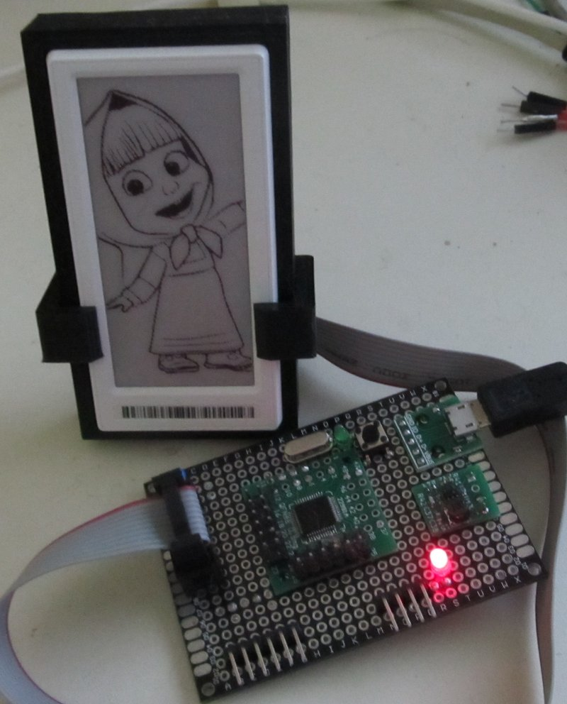

# ZBS243 STM32 based flasher

This project combines Serial Monster  https://github.com/r2axz/bluepill-serial-monster and ZBS Flasher https://github.com/atc1441/ZBS_Flasher

Serial Monster is 3 Port USB-to-Serial adapter.
First VCP is used for  ZBS debugind as conventional serial interface.
Second VCP can be used as ESP8266/ESP32 flasher.
Third VCP is ZBS243 Flasher.
So far as 2 hardware USART are enough, STM32F103C6 can be used.

